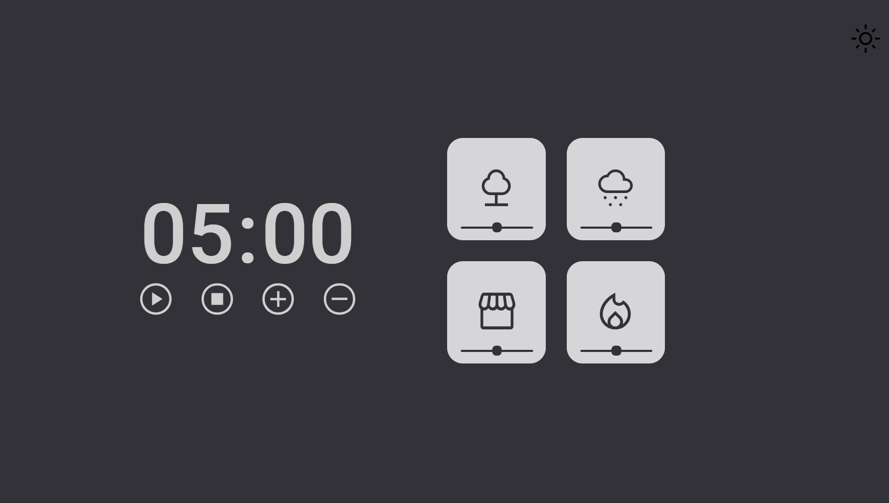
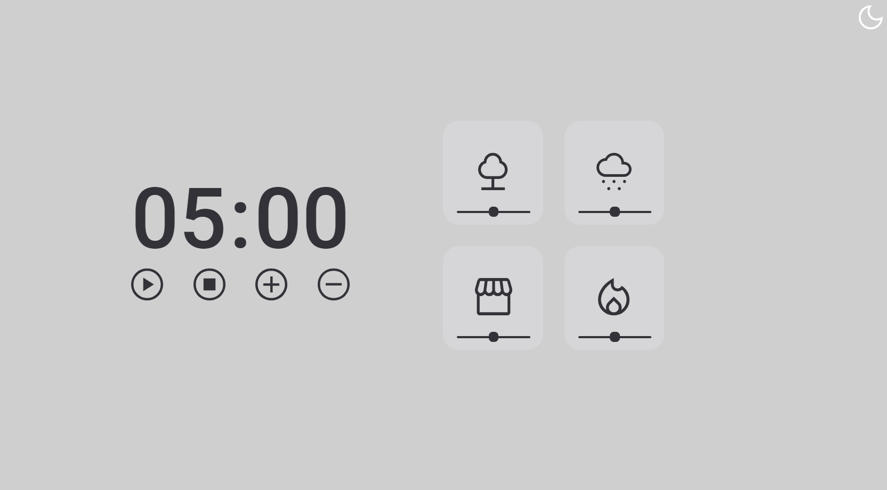

<h1 align="center">Explorer -  Stage05 - Focus Timer (Pomodoro) 2.0</h1>

&nbsp;&nbsp;&nbsp;

 

  🌎 Result Preview: [Veja o Projeto](https://explorer-focus-timer-2-0-stage05.vercel.app/)

---

## 💻 Projeto - Focus Timer (Pomodoro) 2.0

Projeto realizado durante o programa Explorer da Rocketseat localizado no nível 5, onde construímos um timer para conhecer conceitos de DOM, funções callbacks, recursividade, princípios de Clean Code, escopos, es6 Modules, padrão factory, injeção de dependências e áudios pelo js.

Focus Timer 2.0

## 🧪 Tecnologias | HTML ,CSS e JS.
---
- Funções
- Callbacks
- Eventos
- ES6 Modules  
- Clean Code
- recursividade
- Injeção de Dependentes
- Factory
- Audios pelo Js

##  📕 Sobre  

Este é um projeto desenvolvido em treinamento, juntamente com a 
<a  href="https://www.rocketseat.com.br">Rocketseat</a> 🚀
no decorrer do programa <b>Explorer</b>.

### Informações  

🕛 **Status:** Concluído✔️

☑️ **Task:** Construir um site estático a partir do projeto feito no [Figma](https://www.figma.com).
- [Design Figma - Focus Timer 2.0](https://www.figma.com/file/KJj8xx5FB7WuBNUALiV3QK/Stage-05---Dark-Mode-FocusTimer-(Copy)?type=design&node-id=0-8&mode=design&t=ZKN7f8AIllvjDUxK-0)
- [EXPLORER - Rocketseat](https://www.rocketseat.com.br/explorer)

Developed by Jeferson 🚀

